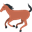

<!-- Title -->
<div align="center">

# AsciimojisFor0ad

<p>
<a href="https://github.com/Atepir/AsciimojisFor0ad/releases"></a>
<a href="https://play0ad.com/download/"></a>
<a href=""></a>
<a href="https://wildfiregames.com/forum/topic/110806-chat-modding-asciimojis"></a>
</p>

<p>
<!-- dev badges -->
<a href="https://github.com/Atepir/AsciimojisFor0ad/commits/main"></a>
<a href="https://github.com/Atepir/AsciimojisFor0ad/graphs/contributors"></a>
<a href="https://github.com/Atepir/AsciimojisFor0ad/commits/main"></a>
</p>

<p>
<!-- emoji showcase -->





</p>

</div>

This is a mod for 0ad which provides Emojis and Asciimojis, because a game about building an empire deserves better than `:)`.

Requires 0 A.D. 0.28 (Alpha 28).

Emojis are the point of this mod : 70 of them hide behind a `:name:` command and are drawn as real pictures, in the lobby chat, in the game setup and in-game. Type `:fire:`, `:swords:` or `:elephant:` and see for yourself — the [emoji list](#emoji-list) shows them all.

Only the players who have the mod installed and enabled get to see the pictures : the others merely read the text. Curious about who sees what? [Have a look](#who-sees-what).

The old asciimojis are still there, for those who have the mod and for those who don't — writing `:lenny:` for this awesome guy ( ͡° ͜ʖ ͡°) may still be pretty good :)

Because it still in developpement, please feel free to report me any error you find to atepir0\<at\>gmail.com.

## Emojis
Emojis are written with a `:name:` command : for instance `:smile:`, `:fire:` or `:elephant:`. There are 70 of them, from `:smile:` to `:elephant:`, `:swords:` and `:sos:` (for when your base is on fire), and they are all displayed with their picture in the [emoji list](#emoji-list). The machine readable list is in [tools/emojis.json](tools/emojis.json).

### Who sees what
Here is the small tragedy of this mod : emojis are drawn as inline pictures, so **only the players who have the mod installed and enabled can see them**. Everybody else still reads something meaningful, but let's be honest, it is not quite the same thing :

| What you write | Player without the mod reads | Player with the mod sees |
| --- | --- | --- |
| `:fire:` (emoji without an asciimoji) | the text `:fire:` | the 🔥 picture |
| `:lenny:` (emoji with an asciimoji) | the asciimoji `( ͡° ͜ʖ ͡°)`, exactly as before this mod | the picture |

19 of the asciimojis have a picture as well : all of them but `:blackeye:`, `:blubby:`, `:claro:`, `:dope:`, `:eeriemob:`, `:lennygang:` and `:lennystrong:`.

### Emojis without the mod
Good news for the friends who refuse to install it : the pictures are resolved when the message is *displayed*, on the machine of whoever reads it, and the `:name:` form is recognized as such. They can therefore type `:fire:` by hand like a pro, and every modded player will see the picture. Only the auto-completion (typing `:` opens the list of names) and the preview in the chat input are reserved to the modded ones.

It also means that a picture can't be faked : the game escapes the square brackets of a chat message before it is displayed, so a player typing a raw `[icon]` tag only ever shows that text.

### Multiplayer compatibility
Emojis are sent as text and drawn by the GUI of the player who reads them, and the mod declares `"ignoreInCompatibilityChecks": true` in its [mod.json](mod.json). Modded and unmodded players can therefore play the same game, so no need to convert your whole lobby first : the lobby lists the mod in grey with the tooltip *"This mod does not affect MP compatibility"*, and a replay recorded with the mod still loads without it.

### How it works
- The game engine cannot draw emoji characters (😀 and friends): its font renderer only handles 16 bit codepoints, and none of the fonts it ships contains an emoji glyph. Emojis are therefore drawn as inline pictures, using the `[icon]` tag of the GUI, which has to be registered by the mod on every page that displays a chat.
- What is sent over the network is the asciimoji itself, so players that don't have the mod still see it exactly as before. Emojis that have no asciimoji equivalent are sent as their `:name:`.
- Emojis are displayed in the in-game chat, in the game setup chat and in the lobby chat.

Emojis can be disabled by setting `asciimojis.emojis = false` in the user config file (`%APPDATA%\0ad\config\user.cfg` on Windows): the asciimojis and the `:name:` of the emojis are then displayed as plain text.

### Emoji list
<details>
<summary>Spoiler : all the 70 emojis with their picture (click to expand)</summary>

| | | | | |
| --- | --- | --- | --- | --- |
|  `:smile:` |  `:grin:` |  `:joy:` |  `:rofl:` |  `:wink:` |
|  `:hearteyes:` |  `:kiss:` |  `:smirk:` |  `:thinking:` |  `:neutral:` |
|  `:confused:` |  `:cry:` |  `:sob:` |  `:yawn:` |  `:mad:` |
|  `:rage:` |  `:cool:` |  `:eyebrow:` |  `:sick:` |  `:dead:` |
|  `:ghost:` |  `:alien:` |  `:clown:` |  `:poop:` |  `:fire:` |
|  `:boom:` |  `:star:` |  `:heart:` |  `:brokenheart:` |  `:thumbsup:` |
|  `:thumbsdown:` |  `:ok:` |  `:clap:` |  `:pray:` |  `:wave:` |
|  `:muscle:` |  `:fist:` |  `:handshake:` |  `:facepalm:` |  `:shrug:` |
|  `:check:` |  `:cross:` |  `:warning:` |  `:question:` |  `:eyes:` |
|  `:crown:` |  `:trophy:` |  `:swords:` |  `:shield:` |  `:castle:` |
|  `:elephant:` |  `:horse:` |  `:sheep:` |  `:beer:` |  `:pizza:` |
|  `:cake:` |  `:coffee:` |  `:idea:` |  `:party:` |  `:gift:` |
|  `:rainbow:` |  `:snow:` |  `:moon:` |  `:sun:` |  `:sos:` |
|  `:flower:` |  `:sunglasses:` |  `:salute:` |  `:music:` |  `:pensive:` |

</details>

### Adding or changing an emoji
The pictures come from [twemoji](https://github.com/jdecked/twemoji) (CC-BY 4.0).
To add or change an emoji, edit [tools/emojis.json](tools/emojis.json) and the `g_AsciimojisEmoji`/`g_AsciimojisAsciiArt` lists of `gui/common/global~asciimojis.js`, then run:

```
powershell -ExecutionPolicy Bypass -File tools/fetch-emoji-assets.ps1
```

This downloads the pictures into `art/textures/ui/asciimojis/` and regenerates the three files that register the icons: `gui/common/resources/setup_asciimojis_icons.xml` (in-game chat), `gui/lobby/icons/asciimojis.xml` (lobby chat) and `gui/gamesetup/setup.xml` (game setup chat). The last one replaces a file of the game (the game includes it as a file and not as a directory), which is why the generator keeps its vanilla content.

Keep the pictures at 32x32: the engine only converts textures whose dimensions are a power of two, and aborts the build of the pyromod when it meets another size. `tools/fetch-emoji-assets.ps1 -Check` verifies this (and that the emoji lists are in sync), which is what the CI runs.

## Asciimojis
The ancestors of all this : each one is preceeded by the command that displays it, and 19 of them also come with a picture (see [who sees what](#who-sees-what)) :

- `:angry:` `•``_``•`
- `:blackeye:` `0__#`
- `:blubby:` `( 0 _ 0 )`
- `:bored:` `(-_-)`
- `:claro:` `(͡ ° ͜ʖ ͡ °)`
- `:dope:` `<(^_^)>`
- `:dunno:` `¯\\(°_o)/¯`
- `:eeriemob:` `(-(-_-(-_(-_(-_-)_-)-_-)_-)_-)-)`
- `:endure:` `(҂◡_◡) ᕤ`
- `:flor:` `(✿◠‿◠)`
- `:glasseoff:` `( ͡° ͜ʖ ͡°)ﾉ⌐■-■`
- `:hello:` `(ʘ‿ʘ)/`
- `:help:` `\\(°Ω°)/`
- `:lenny:` `( ͡° ͜ʖ ͡°)`
- `:lennygang:` `( ͡°( ͡° ͜ʖ( ͡° ͜ʖ ͡°)ʖ ͡°) ͡°)`
- `:lennystrong:` `ᕦ( ͡° ͜ʖ ͡°)ᕤ`
- `:lol:` `L(° O °L)`
- `:love:` `♥‿♥`
- `:nerd:` `(⌐⊙_⊙)`
- `:nice:` `( ͡° ͜ °)`
- `:really:` `ò_ô`
- `:sadlenny:` `( ͡° ʖ̯ ͡°)`
- `:thanks:` `\\(^-^)/`
- `:this:` `( ͡° ͜ʖ ͡°)_/¯`
- `:yolo:` `Yᵒᵘ Oᶰˡʸ Lᶤᵛᵉ Oᶰᶜᵉ`
- `:zombie:` `[¬º-°]¬` 

## Guide to installation
1. Download the latest release from the [releases page](https://github.com/Atepir/AsciimojisFor0ad/releases).

2. Launch the .pyromod file with 0ad.

3. Check in the mod selection screen that the mod is enabled: it is enabled automatically when the .pyromod is launched. A disabled mod is a sad mod, and you would be reading `:fire:` like everybody else.